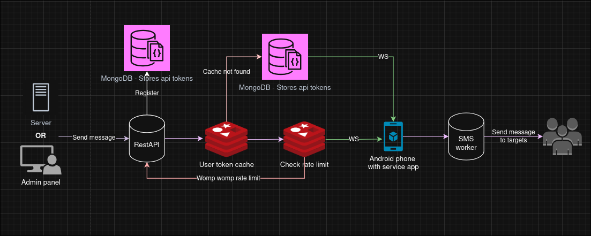

<h1 align="center" style="display: flex; align-items: center; justify-content: center;">
   Whisper 
</h1>

<div align="center">
    
</div>

<br>

<p align="center">
   This project transforms an Android device into a fully functional SMS server.
   It provides a secure and scalable architecture for sending and managing SMS messages through a REST API and WebSocket communication.
</p>

<h1 align="center" style="display: flex; align-items: center; justify-content: center;">
   System Architecture
</h1>



---

## Setup REST API

You can install and run the REST API in multiple ways:

**Using Docker:**

```bash
docker pull ghcr.io/idankoblik/whisper:<version>
docker run -e CONFIG_PATH=/path/to/config.yaml -e APP_ENV=env ghcr.io/idankoblik/whisper:<version>
```

**Using precompiled Linux executable:**

1. Download the binary from GitHub Releases.
2. Make it executable and run:

```bash
chmod +x whisper
CONFIG_PATH=/path/to/config.yaml APP_ENV=env ./whisper
```

**Building from source:**

1. Clone the repository and navigate to the `api` folder:

```bash
cd api
go mod tidy
make build
```

2. Run the executable with environment variables:

```bash
CONFIG_PATH=/path/to/config.yaml APP_ENV=env ./whisper
```

**Environment variables:**

* `CONFIG_PATH` → path to the configuration file
* `APP_ENV` → environment (e.g., `env`) used in the config

**Configuration file structure (`config.env.yaml` example):**

```yaml
addr: ""
admin_token: ""
rate_limit: 60 # optional, per minute

mongo:
  connection_string: ""
  database: ""

redis:
  addr: ""
  password: ""
  db: 0
```

---

## API Reference

#### Register a new API user

Allows an admin to create a new API user and receive an API token

```http
POST /api/admin/register
```


**Header Parameters:**

| Parameter       | Type     | Description               |
| --------------- | -------- | ------------------------- |
| `X-Admin-Token` | `string` | **Required**. Admin token |

**Responses:**

| HTTP Code | Description                       |
| --------- | --------------------------------- |
| 201       | API token for the new user        |
| 400       | Bad Request                       |
| 401       | Unauthorized: Invalid admin token |
<br>

#### Unregister a user

Allows an admin to delete a user by API token

```http
DELETE /api/admin/unregister/{ApiToken}
```


**Header Parameters:**

| Parameter       | Type     | Description               |
| --------------- | -------- | ------------------------- |
| `X-Admin-Token` | `string` | **Required**. Admin token |

**Responses:**

| HTTP Code | Description                       |
| --------- | --------------------------------- |
| 200       | Deleted {ApiToken}                |
| 400       | Bad Request                       |
| 401       | Unauthorized: Invalid admin token |
<br>

#### Ping the server

Simple health check endpoint

```http
GET /api/ping
```


**Responses:**

| HTTP Code | Description |
| --------- | ----------- |
| 200       | pong        |
<br>

#### Send a message

Sends a message through the API using the user's token

```http
POST /api/send
```


**Header Parameters:**

| Parameter     | Type     | Description                  |
| ------------- | -------- | ---------------------------- |
| `X-Api-Token` | `string` | **Required**. User API token |

**Body Parameters:**

| Parameter     | Type            | Description |
| ------------- | --------------- | ----------- |
| `device_id`   | `string`        |             |
| `message`     | `string`        |             |
| `subscribers` | `array[string]` |             |

**Responses:**

| HTTP Code | Description         |
| --------- | ------------------- |
| 200       | Message sent        |
| 400       | Bad Request         |
| 401       | Unauthorized        |
| 429       | Rate limit exceeded |
<br>

#### Check device status

Checks if a given device is registered and active based on its heartbeat record.

```http
GET /api/status/{DeviceID}
```


**Header Parameters:**

| Parameter     | Type     | Description                                |
| ------------- | -------- | ------------------------------------------ |
| `X-Api-Token` | `string` | **Required**. API token for authentication |

**Responses:**

| HTTP Code | Description           |
| --------- | --------------------- |
| 200       | Device is active      |
| 401       | Unauthorized          |
| 404       | Device not found      |
| 500       | Internal server error |
<br>
